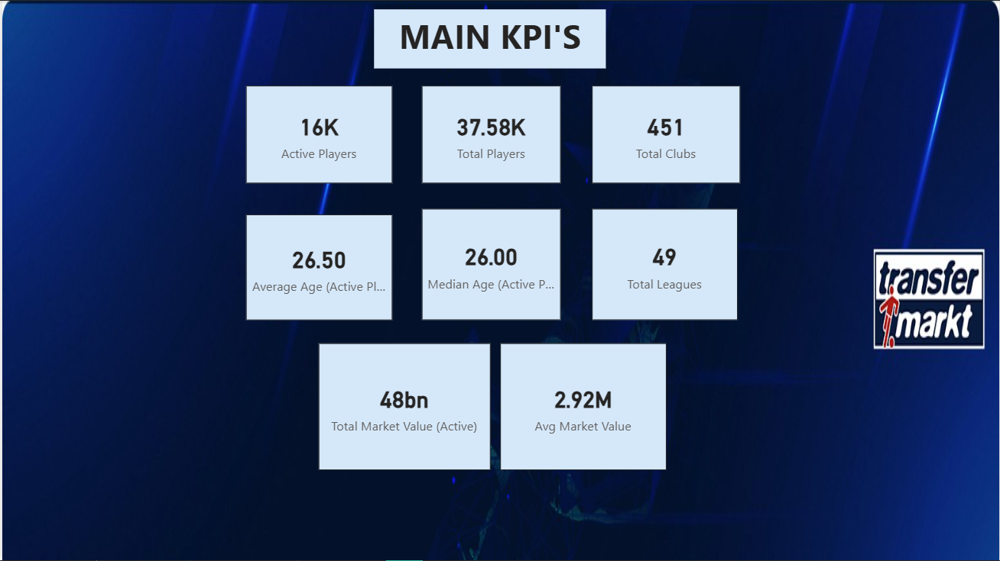
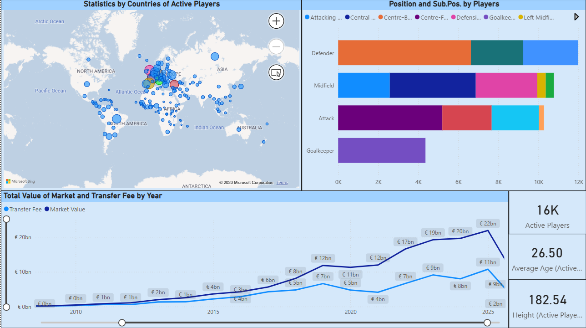
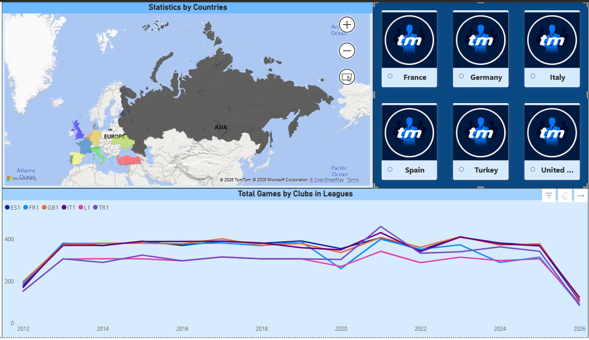
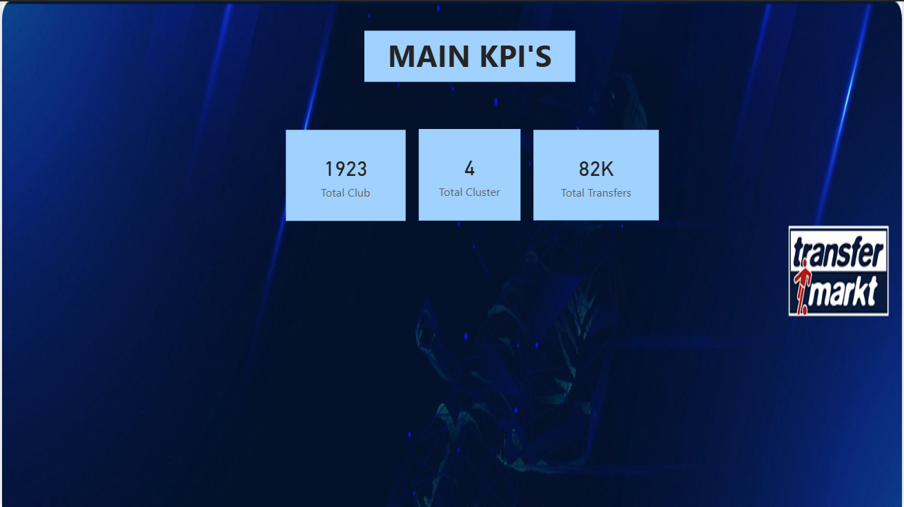
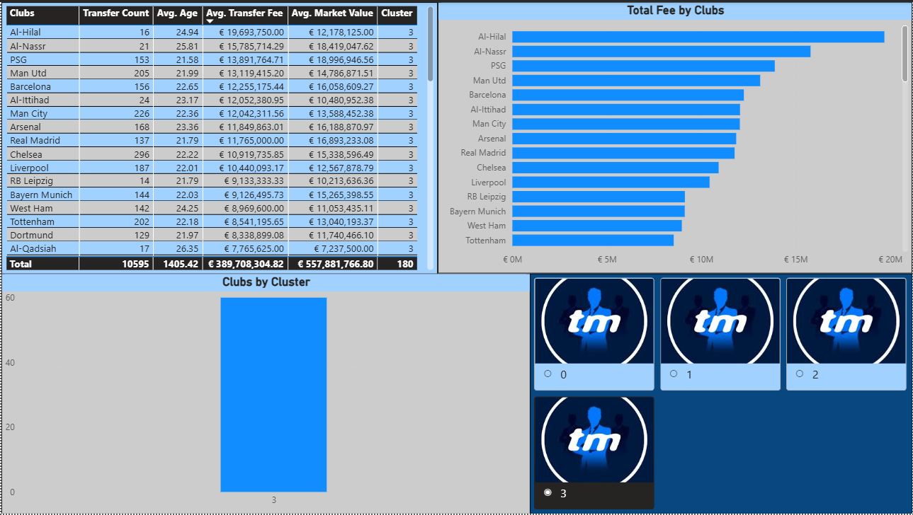

# transfermarkt-data-analysis
Transfermarkt football analysis project using BigQuery, Python and Power BI
In this project, statistical values ​​were analyzed according to countries and player nationalities. Additionally, Kmeans clustering was applied as a machine learning method.

## Tools
BigQuery(SQL), Python, Power BI

## Key Findings
Global KPIs: total players, clubs, leagues, active players
Country-based analysis: player distribution, average age, market value
Position and sub-position breakdown
Market value and transfer trends
Four clusters were created using the clustering process.
Cluster 0: Many transfers, acquires young players, mostly foreign.
Cluster 1: Few transfers, older players, low cost, and mostly domestic.
Cluster 2: Medium number of transfers, very young players, mostly foreign.
Cluster 3: High budget, acquires experienced but expensive players, medium foreign player ratio.

## Dashboard

## Sources
Main KPI's Project: [View My Project](https://drive.google.com/file/d/1SeNy5AdbJlSR8Ri7Dmw2O-pfJWM1eUxv/view?usp=sharing)
Dataset: [Data Source](https://www.kaggle.com/datasets/davidcariboo/player-scores?select=players.csv)
Cluster.pbix
Pattern_v3.ipnyb

## Conclusion
Data-driven insights were generated to support scouting and decision-making.
